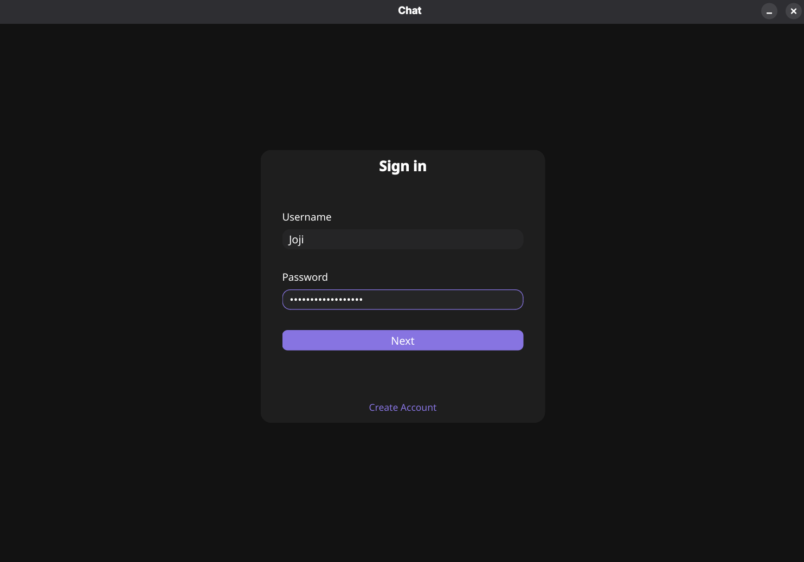
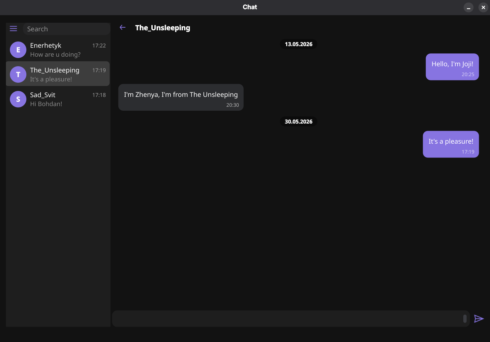

# CryptoChat: Zero-Knowledge Messenger


> A fully functional zero-knowledge client-server messenger written in C++ using the asynchronous functionality of Boost.Beast for the server side, Qt framework for the client side, with libsodium for E2EE


<p align="center">
   
   
<p>


## Core concept & Architecture
### Zero-Knowledge Philosophy
The main goal behind this project is to create a messenger where the server **cannot** get access to chats of the users, but still it **holds** all of the messages.


When designing an architecture for this system, the primary focus was on the assumption that **the server could be compromised at any point**. Therefore, the entire logic around this premise: the server acts strictly as a **relay** and a **storage vault** for raw strings of encrypted messages, with **no** technical ability to decrypt the data sent between users.


### Cryptographic Protocol & Key Management
To achieve a zero-knowledge architecture, all cryptographic operations are **offloaded entirely** to the client side. The key management lifecycle operates as follows:
* **Account creation:**


   1. The client application hashes the user's password and derives two separate keys using KDF.
   2. The application generates an asymmetric key pair: a `Public key` and a `Private key`.
   3. The private key is encrypted localy using password-derived key.
   4. The application sends the `Username`, `Salt`, `Public Key`, `Identification Key` and the `Encrypted Private Key` to the server.


* **User Authentication & Decryption:** During each login, the application prompts for the password to derive the identification and encryption keys. Instead of generating a new key pair, it requests the `Encrypted Private Key` from the server and decrypts it locally using the password-derived key. The plaintext private key **never leaves** the client side; it is stored in secure memory regions that prevent memory swapping and protect it from being compromised by the OS or the processes.


* **End-to-End Encryption:** Messages are encrypted using the recipient's `Public Key` before dispatch and can only be decrypted by the recipient's locally stored `Private Key`.


### Architectural solutions
* **Dual io_context Asynchronous Architecture:** To achieve high throughput and eliminate thread blocking, the server core utilizes two separate **Boost.Asio** `io_context` instances:
   * **Network I/O thread:** Handles incoming WebSocket connections, handshake protocols, and messaging retransmission using non-blocking I/O.
   * **Database thread:** Dedicated to handling persistent storage tasks. By offloading heavy database queries to a separate context, the network thread is never blocked, ensuring minimal latency for active users.
* **Data Transfer:**
   * **Serialization Layer:** Communication between the Qt client and the Beast server is established via `JSON` packets handled by **Boost.Json** and **Qt JSON modules**
   * **Design patterns:** The backend stricly implements the **Repository Pattern** and decouples SQL from network protocols. Specialized DTOs and mappers ensure that incoming network payloads are converted into cleanly structured database entities.
* **Session Lifecycle & Memory Management:** To prevent circular dependencies and memory leaks between the network connection classes, the server implements a decoupled ownership model using modern C++ pointers:
   * **Session Manager:** Acts as registry, holding a hashed map of active connections stored as `std::weak_ptr<sessions>`.
   * **Circular Dependencies:** By utilizing `std::weak_ptr`, the `session` class can communicate back to the `session_manager` without creating a strong reference cycle.
   * **Safe resource cleanup:** When a client disconnects, the session terminates naturally. The manager safely cleans up expired references by checking the validity of the weak pointer before any operation, ensuring zero dangling pointers or memory corruption.
* **Decoupled & Optimistic Client UI:** The desktop client is engineered using **Qt 6**, adhering to strict software engineering patterns rather than tight UI-logic coupling:
   * **Controller-Driven Architecture:** The UI pages do not communicate with the network layer directly. Instead, they interact via a centralized `Controller` class that acts as a structural bridge. It coordinates the application's data flow by reacting to user interactions from the GUI and handling incoming network events, routing all data exclusively through **Qt Signals & Slots** to maintain a clean, asynchronous, event-driven flow.
   * **Model/View/Delegate Architecture:** Message histories and user lists are handled using **Qt's Model/View**. Custom models manage the underlying data, while delegates handle efficient rendering, preventing UI freezes even with large chat logs.
   * **Optimistic UI Paradigm:** To deliver a seamless user experience, the interface utilizes optimistic updates. For instance, when a message is sent, it appears in the chat instantly, while the delivery timestamp is resolved and updated asynchronously in the background once the server responds.
* **Zero-Knowledge Storage Schema:** The database contains no plaintext messages, no raw passwords, and no decrypted private keys. Messages are stored strictly as encrypted, Base64-encoded strings. Consequently, even a full database leak guarantees zero exposure of user conversations, as the stored data remains cryptographically useless without the decryption performed by the client-side.


## Building the project
### Prerequisites
Ensure your system has CMake and the necessary packages (`libsodium`, `boost`, `qt6`, `postgresql`) installed.


Note the C++ standards requirements for compilation:
* **Server-side:** Requires a **C++20** compatible compiler.
* **Client-side:** Requires a **C++17** compatible compiler (optimized for the Qt 6 application core).


## Complitation
1. **Clone the repository:**
   ```bash
   git clone [https://github.com/McQueeh95/ChatProject.git](https://github.com/McQueeh95/ChatProject.git)
   cd CharProject
   ```
2. Build the Server:
   ```bash
   mkdir build_server && cd build_server
   cmake ../server
   cmake --build .
   cd ..
   ```
3. Build the Client:
   ```bash
   mkdir build_client && cd build_client
   cmake ../client
   cmake --build.
   ```
### Important Notes & Network Configuration
* **Local Deployment Only:** Currently, all network connections and database connections are hardcoded to `localhost` for local testing. To run the application across different machines, these configurations must be updated manually in the source files to match your specific network setup.


## Roadmap
* [ ] **Automated Testing & CI/CD:** Implement unit tests for cryptographic modules and server repositories, followed by setting up a GitHub Actions pipeline.
* [ ] **Advanced Server Logging:** Integrate a structured logging framework to provide clean, readable, and detailed console output for server events.
* [ ] **Real-Time Presence & Statues:** Add user presence indicators, message read receipts, and native OS push notifications for new messages.
* [ ] **Dynamic Configuration:** Move hardcoded IP's and database connection strings into external configuration files for seamless multi-machine deployment.


